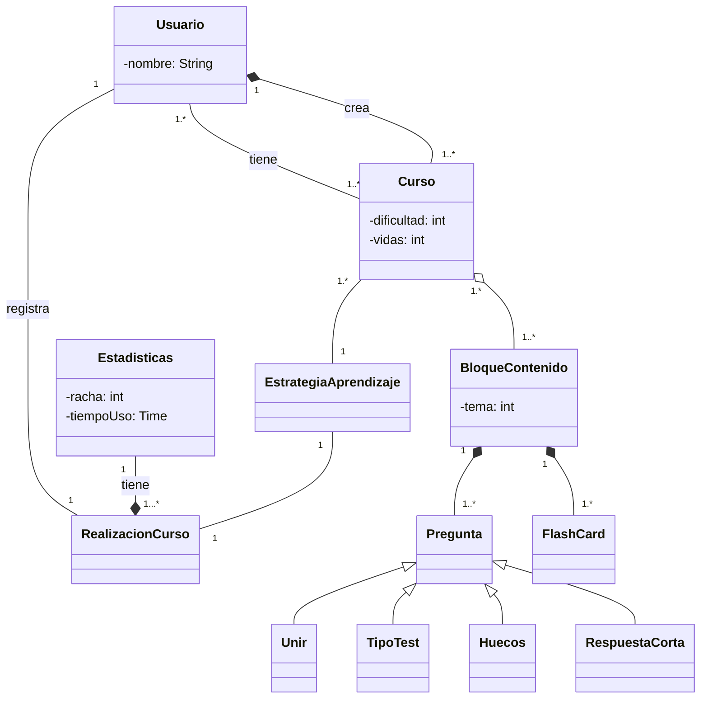

```mermaid
classDiagram
    Usuario "1" -- "1" RealizacionCurso : registra
    Estadisticas "1"--*"1...*" RealizacionCurso : tiene

    EstrategiaAprendizaje "1"--"1" RealizacionCurso
    Usuario "1.*" -- "1..*" Curso : tiene
    Usuario "1" *-- "1..*" Curso : crea
    Curso "1.*" -- "1" EstrategiaAprendizaje
    Curso "1.*" o-- "1..*" BloqueContenido
    BloqueContenido "1" *--"1..*" Pregunta
    Pregunta <|-- Unir
    Pregunta <|-- TipoTest
    Pregunta <|-- Huecos
    Pregunta <|-- RespuestaCorta
    BloqueContenido "1" *-- "1.*" FlashCard

    class Usuario {
        -nombre: String
    }
    class Estadisticas {
        -racha: int
        -tiempoUso: Time
    }
    class Curso {
        -dificultad: int
        -vidas: int
    }
    class EstrategiaAprendizaje {
        
    }
    class BloqueContenido {
        -tema: int
    }
    class RealizacionCurso{
        
    }
```
