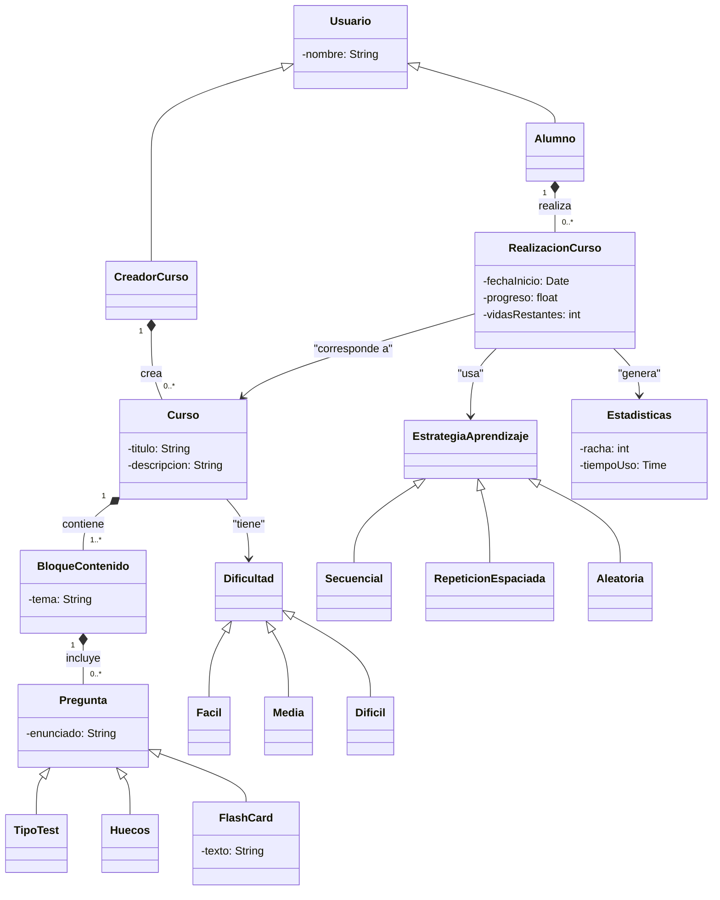

```mermaid
classDiagram
    %% --- Jerarquía de Usuario ---
    class Usuario {
        -nombre: String
    }
    Usuario <|-- Alumno
    Usuario <|-- CreadorCurso

    %% --- Clases de Curso y Bloques ---
    class Curso {
        -titulo: String
        -descripcion: String
    }
    class BloqueContenido {
        -tema: String
    }
    class FlashCard {
        -texto: String
    }

    %% --- Preguntas y Tipos ---
    class Pregunta {
        -enunciado: String
    }
    Pregunta <|-- TipoTest
    Pregunta <|-- Huecos
    Pregunta <|-- FlashCard

    %% --- Dificultad y Estrategia ---
    class Dificultad
    Dificultad <|-- Facil
    Dificultad <|-- Media
    Dificultad <|-- Dificil

    class EstrategiaAprendizaje
    EstrategiaAprendizaje <|-- Secuencial
    EstrategiaAprendizaje <|-- RepeticionEspaciada
    EstrategiaAprendizaje <|-- Aleatoria

    %% --- Realización y Estadísticas ---
    class RealizacionCurso {
        -fechaInicio: Date
        -progreso: float
        -vidasRestantes: int
    }
    class Estadisticas {
        -racha: int
        -tiempoUso: Time
    }

    %% --- Relaciones principales ---

    %% Roles
    CreadorCurso "1" *-- "0..*" Curso : crea
    Alumno "1" *-- "0..*" RealizacionCurso : realiza

    %% Curso y Bloques
    Curso "1" *-- "1..*" BloqueContenido : contiene
    BloqueContenido "1" *-- "0..*" Pregunta : incluye

    %% Realizacion y Curso
    RealizacionCurso --> Curso : "corresponde a"
    RealizacionCurso --> Estadisticas : "genera"
    RealizacionCurso --> EstrategiaAprendizaje : "usa"

    %% Curso y Dificultad
    Curso --> Dificultad : "tiene"

    %% Notas:
    %% - FlashCard hereda de Pregunta para mantener la lógica de pregunta intercalada.
    %% - Puedes añadir más relaciones si necesitas comentarios, calificaciones, etc.

```

  
