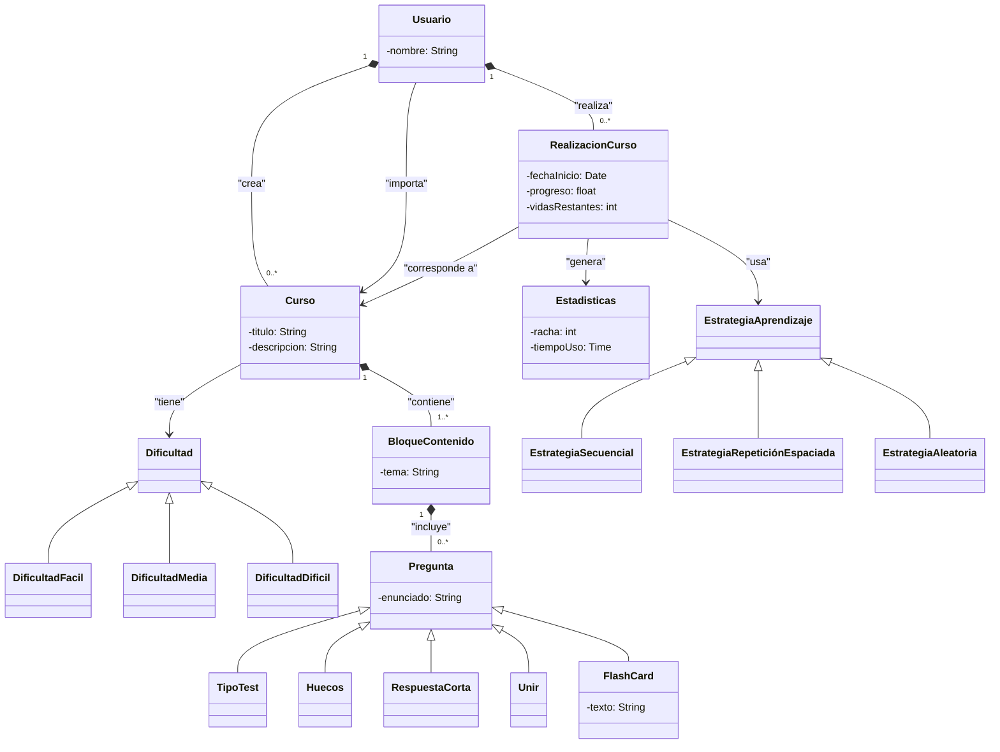

```mermaid
classDiagram

    %% Clases principales %%

    class Usuario {
        -nombre: String
    }

    class Curso {
        -titulo: String
        -descripcion: String
    }

    class RealizacionCurso {
        -fechaInicio: Date
        -progreso: float
        -vidasRestantes: int
    }

    class Estadisticas {
        -racha: int
        -tiempoUso: Time
    }

    class Dificultad {
    }

    class DificultadFacil {
    }

    class DificultadMedia {
    }

    class DificultadDificil {
    }

    class EstrategiaAprendizaje {
    }

    class Estrategia Secuencial {
    }

    class Estrategia Repetición Espaciada {
    }


    class Estrategia Aleatoria {
    }

    class BloqueContenido {
        -tema: String
    }

    class Pregunta {
        -enunciado: String
    }

    class TipoTest {
    }

    class Huecos {
    }

    class RespuestaCorta {
    }

    class Unir {
    }

    class FlashCard {
        -texto: String
    }

    %% Relaciones entre clases %%

    %% Usuario con Curso y RealizacionCurso %%
    Usuario "1" *-- "0..*" Curso : "crea"
    Usuario --> Curso : "importa"
    Usuario "1" *-- "0..*" RealizacionCurso : "realiza"

    %% RealizacionCurso con Curso %%
    RealizacionCurso  -->Curso : "corresponde a"

    %% RealizacionCurso con Estadisticas %%
    RealizacionCurso  --> Estadisticas : "genera"

    %% RealizacionCurso con EstrategiaAprendizaje %%
    RealizacionCurso --> EstrategiaAprendizaje : "usa"

    %% Curso con Dificultad %%
    Curso  -->  Dificultad : "tiene"

    Dificultad <|-- DificultadFacil
    Dificultad <|-- DificultadMedia
    Dificultad <|-- DificultadDificil

    %% EstrategiaAprendizaje como jerarquía %%
    EstrategiaAprendizaje <|-- Estrategia Secuencial
    EstrategiaAprendizaje <|-- Estrategia Repetición Espaciada
    EstrategiaAprendizaje <|-- Estrategia Aleatoria

    %% Curso con BloqueContenido %%
    Curso "1" *-- "1..*" BloqueContenido : "contiene"

    %% BloqueContenido con Pregunta y FlashCard %%
    BloqueContenido "1" *-- "0..*" Pregunta : "incluye"
    

    %% Jerarquía de Preguntas %%
    Pregunta <|-- TipoTest
    Pregunta <|-- Huecos
    Pregunta <|-- RespuestaCorta
    Pregunta <|-- Unir
    Pregunta <|-- FlashCard

```

  
