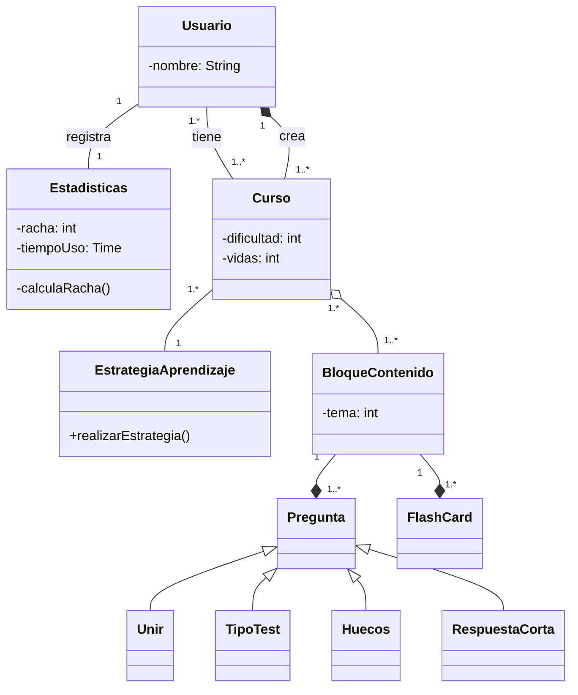

```mermaid
classDiagram
    Usuario "1" -- "1" Estadisticas : registra
    Usuario "1.*" -- "1..*" Curso : tiene
    Usuario "1" *-- "1..*" Curso : crea
    Curso "1.*" -- "1" EstrategiaAprendizaje
    Curso "1.*" o-- "1..*" BloqueContenido
    BloqueContenido "1" --* "1..*" Pregunta
    Pregunta <|-- Unir
    Pregunta <|-- TipoTest
    Pregunta <|-- Huecos
    Pregunta <|-- RespuestaCorta
    BloqueContenido "1" --* "1.*" FlashCard

    class Usuario {
        -nombre: String
    }
    class Estadisticas {
        -racha: int
        -tiempoUso: Time
        -calculaRacha()
    }
    class Curso {
        -dificultad: int
        -vidas: int
    }
    class EstrategiaAprendizaje {
        +realizarEstrategia()
    }
    class BloqueContenido {
        -tema: int
    }

```
